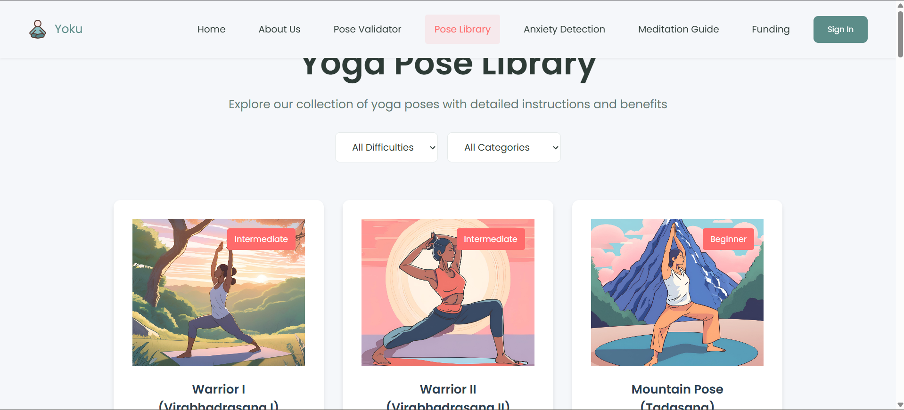
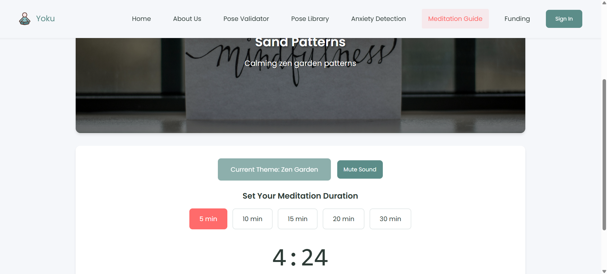

# HealthBook

## Overview
HealthBook is a comprehensive healthcare platform designed to enhance both physical and mental well-being. The platform offers advanced features like yoga pose validation, an anxiety analyzer, meditation guidance, and a funding feature to support those in need.

## Features

### 🧘 Yoga Pose Validation
- AI-powered validation of yoga postures to ensure correct form and effectiveness.
- Real-time feedback to help users improve their yoga practice.

### 🧠 Anxiety Analyzer
- AI-driven tool to assess anxiety levels based on user input.
- Provides actionable insights and recommendations to manage stress and anxiety.

### 🧘‍♂️ Meditation Assistance
- Guided meditation sessions for mindfulness and relaxation.
- Customizable meditation plans for various mental health goals.

### 💰 Funding Feature
- Enables crowdfunding for individuals in need of medical assistance.
- Secure and transparent donation system to help fund healthcare treatments.

## Getting Started
### Prerequisites
- Web browser (Chrome, Firefox, Edge, etc.)
- Internet connection

### Installation
1. Clone the repository:
   ```sh
   git clone https://github.com/haadit/healthbook.git
   ```
2. Navigate to the project directory:
   ```sh
   cd healthbook
   ```
3. Install dependencies:
   ```sh
   npm install
   ```
4. Start the development server:
   ```sh
   npm start
   ```

## Technologies Used
- **Frontend:** React.js, Tailwind CSS
- **Backend:** Node.js, Express.js
- **Database:** MongoDB
- **AI & ML:** TensorFlow.js for yoga pose validation, sentiment analysis for anxiety detection
- **Payment Gateway:** Stripe for funding feature

## Screenshots

### 🧘 Yoga Pose Validation


### 🧠 Anxiety Analyzer


### 🧘‍♂️ Meditation Assistance


### 💰 Funding Feature


## Contribution
We welcome contributions to enhance HealthBook. To contribute:
1. Fork the repository.
2. Create a feature branch (`git checkout -b feature-name`).
3. Commit your changes (`git commit -m 'Add new feature'`).
4. Push to the branch (`git push origin feature-name`).
5. Open a Pull Request.

## License
This project is licensed under the MIT License.

## Contact
For any inquiries or support, feel free to reach out:
- Email: aakashsgbp@gmail.com
- Website: under Development

